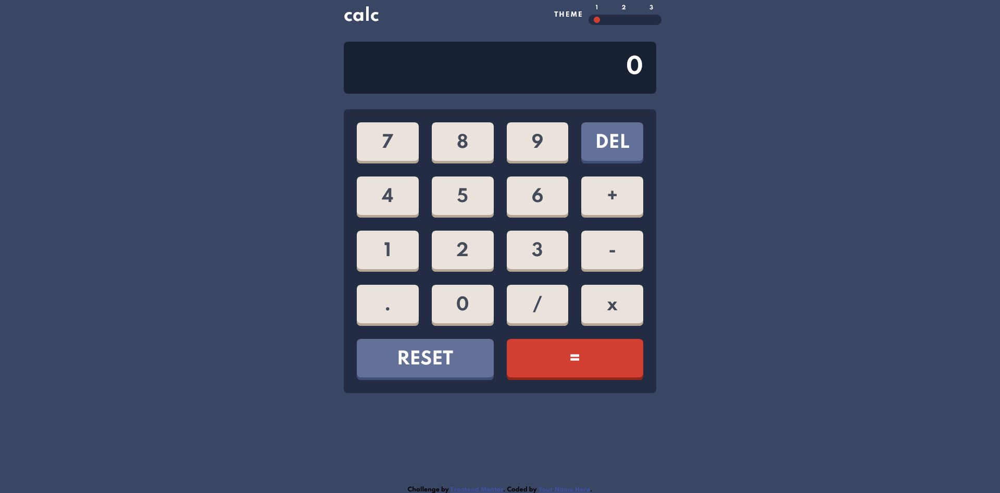

# Frontend Mentor - Calculator app solution

This is a solution to the [Calculator app challenge on Frontend Mentor](https://www.frontendmentor.io/challenges/calculator-app-9lteq5N29). Frontend Mentor challenges help you improve your coding skills by building realistic projects. 

### Screenshot

### Links

- Solution URL: [https://www.frontendmentor.io/solutions/calculator-DcdCNwc5-](https://www.frontendmentor.io/solutions/calculator-DcdCNwc5-)
- Live Site URL: [https://calculator-khaki-ten.vercel.app/](https://calculator-khaki-ten.vercel.app/)

### Built with

- Semantic HTML5 markup
- CSS custom properties
- Flexbox
- CSS Grid
- Desktop-first workflow
- JavaScript
## Author

- Website - [https://github.com/stevandrej](https://github.com/stevandrej)
- Frontend Mentor - [https://www.frontendmentor.io/profile/stevandrej](https://www.frontendmentor.io/profile/stevandrej)